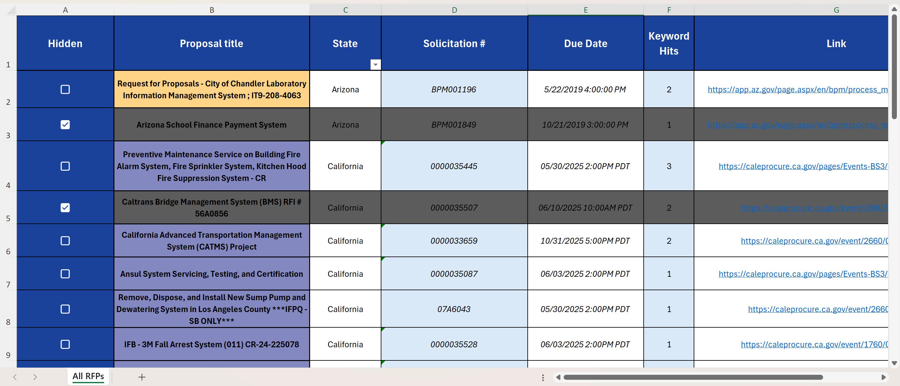

# RFP Scraper

**Modular, scalable Python RFP Scraper** for 50+ U.S. state procurement portals—plug-and-play scraper classes with Excel export.
*Tags:* `rfp` `procurement` `scraper` `selenium` `requests` `excel`

---

## 🔍 Why?

Manually monitoring 20+ keywords across 50+ state procurement websites is a huge time sink.
**RFP Scraper** centralizes all RFP postings into a single `.xlsx` file—so you never miss a bid.

---

## 🚀 Features

* 🔌 Modular core with base classes for `requests`- and `Selenium`-powered scrapers
* ✅ Out-of-the-box support for:

  * Alabama
  * Arizona
  * Arkansas
  * California
  * Colorado
  * Connecticut
  * (More Coming)
* 🗂️ Keyword list (`keywords.txt`): one keyword per line
* ⚙️ Simple settings link-up for new scrapers (add URL or endpoint in `settings.py`)
* 📊 Excel export (`.xlsx`) with:

  * ✓ Header formatting, autofilter, checkboxes, and conditional formatting
  * ✓ Logo insertion
* 📝 Smoke test (`smoke_test.py`) to verify each scraper runs without crashing
* 📈 Scales easily to all 50 states by dropping in new scraper files
* 📝 Basic logging to `output/scraper.log` (INFO + ERROR)

---

## 📂 Repo Layout

```
.  
├── assets/  
│   └── hotb_logo.jpg  
│   └── output_example.png      # sample Excel screenshot  
├── output/  
│   ├── rfp_scraping_output.xlsx  
│   └── scraper.log  
├── scraper/  
│   ├── config/  
│   │   ├── keywords.txt        # one keyword per line  
│   │   └── settings.py         # STATE_RFP_URL_MAP, BUSINESS_UNIT_DICT, etc.  
│   ├── core/  
│   │   ├── base_scraper.py     # (if applicable)  
│   │   ├── requests_scraper.py  
│   │   └── selenium_scraper.py  
│   ├── exporters/  
│   │   └── excel_exporter.py   # builds formatted `.xlsx`  
│   ├── scrapers/  
│   │   ├── alabama.py  
│   │   ├── arizona.py  
│   │   ├── arkansas.py  
│   │   ├── california.py  
│   │   ├── colorado.py  
│   │   └── connecticut.py  
│   ├── tests/                  # (future) unit tests for core & scrapers  
│   └── utils/  
│       ├── data_utils.py       # filter_by_keywords, etc.  
│       ├── date_utils.py       # convert_to_pst, etc.  
│       └── text_utils.py       # (if needed)   
├── main.py                     # entry point: parse args, run selected scrapers, call Excel exporter  
├── LICENSE  
├── README.md  
└── requirements.txt  
```

---

## ⚙️ Installation

```bash
git clone https://github.com/jasonstaker/rfp-scraper.git
cd rfp-scraper
python3 -m venv venv && source venv/bin/activate
pip install -r requirements.txt
```

Requires Python 3.x (tested on 3.13.3).

---

## 📖 Usage

```bash
# Run all supported states:
python main.py --states all

# Or target specific states (space-separated lowercase names):
python main.py --states alabama colorado california
```

* `--states all` runs every scraper in `scraper/scrapers/`
* `--states <name…>` for individual or multiple states
* Outputs:

  * `output/rfp_scraping_output.xlsx`
  * `output/scraper.log`

### Smoke Test

```bash
python smoke_test.py
```

Exits with code 0 if every scraper’s `scrape()` returned a `list` without unhandled exceptions; otherwise exits 1 and prints which state(s) failed.

---

## 🛠️ Configuration

* **Keywords**

  * File: `scraper/config/keywords.txt`
  * Add one keyword per line (case-insensitive). Any RFP whose title or description contains at least one keyword will be tagged.

* **Settings**

  * File: `scraper/config/settings.py`
  * Contains:

    * `STATE_RFP_URL_MAP` → state-to-URL mapping
    * `BUSINESS_UNIT_DICT` → used by the California scraper
    * Other constants (e.g. `FALLBACK_CSRF`)
  * To add a new scraper:

    1. Add its base URL (or endpoint) under `STATE_RFP_URL_MAP["<state>"]`.
    2. If applicable (California), add department→BU mapping in `BUSINESS_UNIT_DICT`.

* **Logging**

  * Configured in `scraper/logging_config.py` (if present) or via `logging.basicConfig` in `main.py`.
  * Output written to `output/scraper.log` at INFO + ERROR levels.

---

## ➕ Adding a New State

1. Create a new file in `scraper/scrapers/`, e.g. `illinois.py`.
2. Subclass one of the base scrapers in `scraper/core/`:

   * `RequestsScraper` for static HTML or JSON endpoints
   * `SeleniumScraper` for dynamic/JS-driven pages
3. Implement:

   * `search(self, **kwargs)` → return page source or JSON
   * `extract_data(self, page_source)` → parse and return `List[Dict]` of raw records
   * (Optional) pagination via `next_page()`
   * `scrape(self, **kwargs)` → orchestrate `search()`, `extract_data()`, pagination, DataFrame, filter, return `List[Dict]`
4. Add entry into `STATE_RFP_URL_MAP` in `settings.py`.
5. Run it with:

   ```bash
   python main.py --states illinois
   ```

---

## ✅ Testing (Early Dev)

*Currently no official unit tests.*
For now, run:

```bash
python smoke_test.py
```

to verify that all built-in scrapers complete without uncaught exceptions.
We plan to add `pytest` tests for:

* Core scraper base classes
* Utility functions (`data_utils`, `date_utils`)
* Individual scraper logic (mocked HTML/JSON)

---

## 📦 Output Columns

The exported `.xlsx` file (“All RFPs” sheet) includes:

|   | Proposal title | State      | Solicitation # | Due Date           | Keyword Hits | Link      |
| - | -------------- | ---------- | -------------- | ------------------ | ------------ | --------- |
|   | **(checkbox)** | **(auto)** | **(auto)**     | **(UTC-7) string** | **(auto)**   | **(URL)** |

1. **First column** is a clickable checkbox for “selected.”
2. **Proposal title** → from each scraper’s `Label`.
3. **State** → capitalized state name (e.g., “California”).
4. **Solicitation #** → from each scraper’s `Code`.
5. **Due Date** → formatted as string in PST (e.g., `2025-06-15 17:00:00 PST`).
6. **Keyword Hits** → comma-separated matched keywords.
7. **Link** → hyperlink to the solicitation page (or portal).

Conditional formatting:

* Alternating row colors per state (blue / yellow).
* Italic formatting for some date columns.
* Hyperlink style on “Link” column.
* Grey-out when checkbox is checked.
* Logo inserted at top left (`A1`).

*Sample screenshot:*


---

## 📦 requirements.txt

```text
beautifulsoup4
pandas
selenium
Pillow
XlsxWriter
requests
pytz
lxml
```

---

## 🤝 Contributing

This project is in early development. If you have ideas—tests, new scrapers, bug fixes—please open an issue or contact me via GitHub.

---

## 📄 License

Licensed under the MIT License. See `LICENSE` for full text.