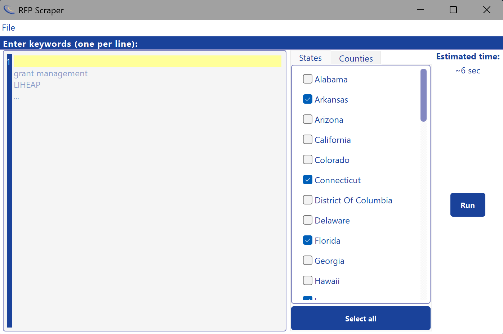
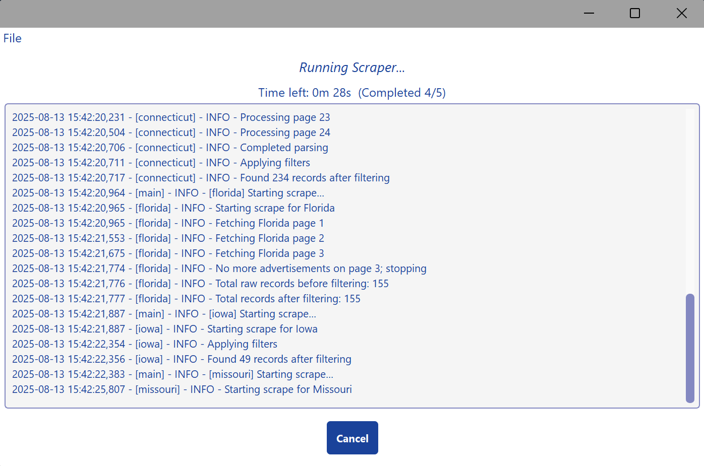
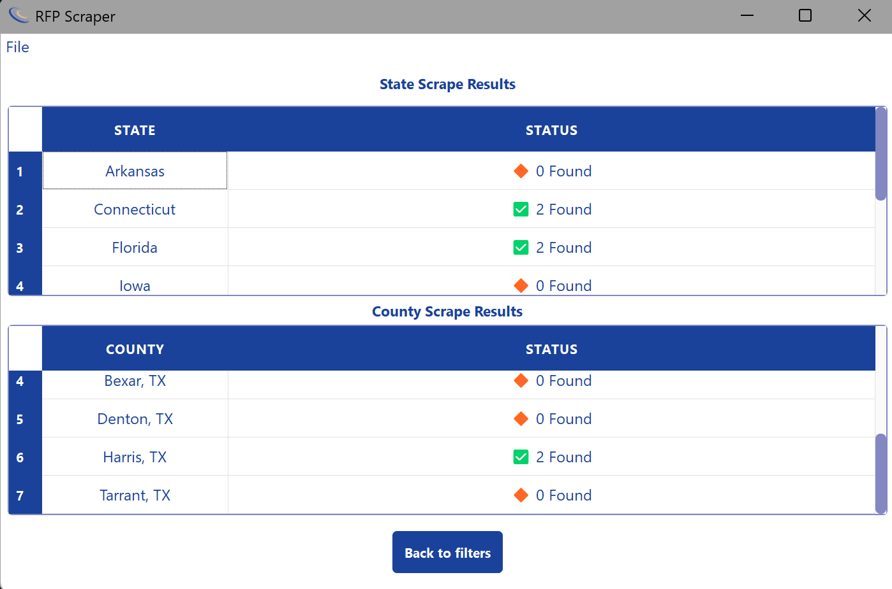
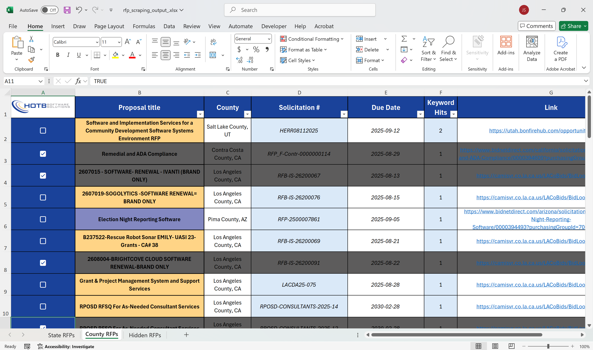

# RFP Scraper

**Tagline:** Automated RFP scraping with a simple, intuitive GUI.

## Table of Contents

1. [Introduction](#introduction)
2. [Features](#features)
3. [Screenshots](#screenshots)
4. [Installation](#installation)
5. [Usage](#usage)
6. [GUI Overview](#gui-overview)

   * [Main Window](#main-window)
   * [Home Page](#home-page)
   * [Run Page](#run-page)
   * [Status Page](#status-page)
7. [Configuration](#configuration)
8. [Project Structure](#project-structure)
9. [Dependencies](#dependencies)
10. [Testing](#testing)
11. [Roadmap](#roadmap)
12. [Contributing](#contributing)
13. [License](#license)
14. [Contact / Support](#contact--support)

## Introduction

RFP Scraper is a cross-platform desktop application that automates fetching current Requests for Proposals (RFPs) from all U.S. state procurement websites (including Washington, D.C.). Its clean PyQt5 GUI lets you select states, enter keywords, track progress, and export results—all with robust retry logic, caching, and rotating logs.

## Features

* **Keyword-driven Searches**
  Enter one keyword per line; the scraper runs each term against every selected portal.

* **Comprehensive State Coverage**
  Support for all 50 states plus D.C., with scrapers kept in sync and uniformly styled.

* **Multi-State Selection**
  Check any combination from a scrollable list or “Select All” to process every jurisdiction.

* **Background Scraping & Cancel**
  Runs in a separate thread so the UI remains responsive. Hit **Cancel** at any time.

* **Real-time Log Tailing**
  Watch live progress and detailed errors in the Run page; logs now rotate via a `RotatingFileHandler` to keep file size bounded.

* **Normalized Export DataFrame**
  Every scraper’s output DataFrame is standardized; Excel exports apply consistent formatting and text wrapping.

* **Results Status Page**
  Final table shows ✅ Passed or ❌ Failed per state (fail system finalized on Jul 2, 2025), with any run-level error shown at top.

* **Excel Export & Caching**
  Saves to `output/cache/` (latest five only), opens the most recent automatically, and retains hidden-ID persistence.

* **Persistent Keywords & Hidden IDs**
  Keywords in `keywords.txt`; hidden-IDs sync bug fixed so your manual hides persist across runs.

* **Robust Date Parsing**
  `parse_date_generic` corrected for inconsistent formats (Florida, capitalization fixes on the Home page, Virginia headless window sizing adjusted).

## Screenshots

1. **Home Page**
   
   *Enter keywords (left), select states (center), click **Run** (right).*

2. **Run Page**
   
   *Live log output streams as each scraper runs; click **Cancel** to abort.*

3. **Status Page**
   
   *✅ Passed or ❌ Failed per state. “Back to Filters” returns you to Home without clearing keywords.*

4. **Excel Output Example**
   
   *Standardized columns, text wrapping, and formatted dates.*

## Installation

### Prerequisites

* **Python 3.8+**
* **OS Support:** Windows 10/11, macOS 10.15+, Linux (Ubuntu 20.04+)

### Step-by-Step

```bash
git clone https://github.com/jasonstaker/rfp-scraper.git
cd rfp-scraper
python3 -m venv venv

# macOS/Linux:
source venv/bin/activate
# Windows PowerShell:
# .\venv\Scripts\Activate.ps1

pip install -e .
```

To launch:

```bash
rfp-scraper
```

—or—

```bash
python scripts/main.py
```

## Usage

1. **Launch** the app (double-click icon or run `python main.py`).
2. On **Home Page**:

   * Enter one keyword per line.
   * Select your states (or **Select All**).
   * Click **Run**.
3. **Run Page**:

   * Watch live, rotating logs tail into the UI.
   * Click **Cancel** anytime to stop and return home.
4. **Status Page**:

   * View ✅ Passed / ❌ Failed statuses.
   * Click **Back to Filters** to adjust without clearing keywords.
5. The latest Excel export (standardized DataFrame) lives in `output/cache/` and auto-opens on success.

## GUI Overview

### Main Window

* **QStackedWidget** for seamless Home → Run → Status navigation.
* Opens at half your monitor’s width × height.

### Home Page

* **Keyword Editor:** Multi-line `CodeEditor` (loads/saves `keywords.txt`).
* **State List:** Scrollable `QListWidget` with “Select All” toggle.
* **Run Button:** Starts the background scrape worker.

### Run Page

* **Log Output:** Tails `output/scraper.log` (now managed by a rotating handler).
* **Cancel Button:** Aborts worker and returns to Home.

### Status Page

* **Results Table:** Two columns—**State** & **Status** with icons.
* **Error Display:** Show any scraper-level exception at top.
* **Back to Filters:** Returns to Home preserving keyword list.

## Configuration

* **`src/config.py`**

  * `KEYWORDS_FILE`: path to `keywords.txt`
  * `CACHE_DIR`: holds last five Excel exports
  * `LOG_FILE`: path to rotating `scraper.log`
* **`scraper/config/settings.py`**

  * `STATE_RFP_URL_MAP`: state⇒portal URL mapping
  * `AVAILABLE_STATES`: ordered list for the UI

## Project Structure

```text
rfp-scraper/
├── README.md
├── LICENSE
├── scripts/
│   └── main.py
├── assets/
│   └── screenshots/
├── output/
│   ├── cache/                # Latest 5 Excel exports
│   └── scraper.log           # RotatingFileHandler
├── persistence/
│   └── hidden_ids.json
├── src/
│   ├── config.py
│   ├── ui/
│   │   ├── main_window.py
│   │   └── pages/
│   ├── scraper/
│   │   ├── config/
│   │   ├── core/
│   │   ├── exporters/
│   │   ├── scrapers/         # 50 states + DC, uniformly formatted
│   │   └── utils/
│   └── runner.py
└── tests/
    └── test_*.py
```

## Dependencies

* requests
* selenium
* pandas
* beautifulsoup4
* webdriver-manager
* openpyxl
* xlsxwriter
* lxml
* xlrd
* pillow
* pyqt5

## Testing

```bash
pytest
```

Covers core logic, utilities, and basic runner integration. GUI behavior remains manual for now.

## Roadmap

* **Progress bars** per state scraping
* **Auto-complete keyword suggestions**
* **CSV/PDF export** alongside Excel
* **Extended GUI improvements** based on feedback

## Contributing

We’re currently accepting focused, high-quality contributions—please email ideas or PRs.

## License

MIT License — see [LICENSE](LICENSE).

## Contact / Support

**Author:** Jason Staker ([jason.staker@yahoo.com](mailto:jason.staker@yahoo.com))
