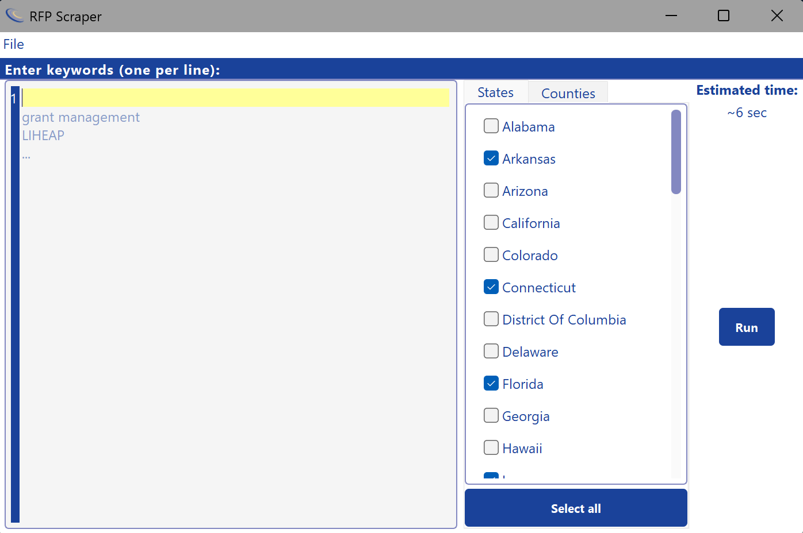
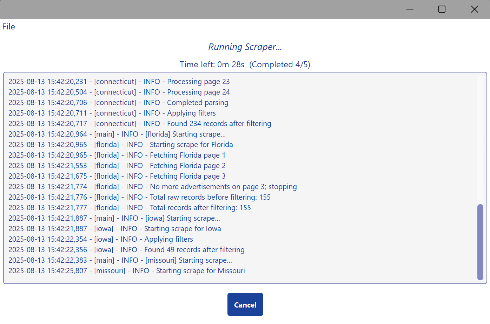
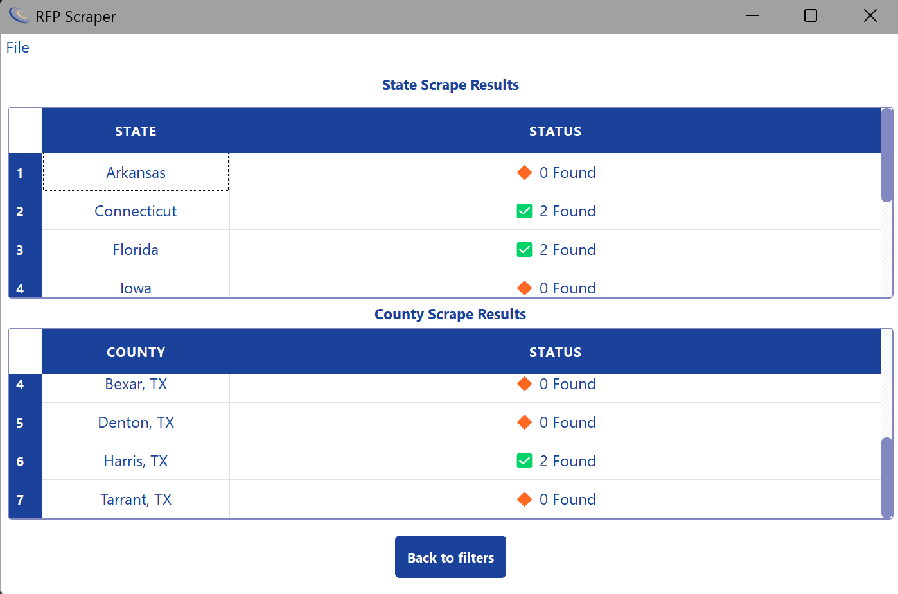
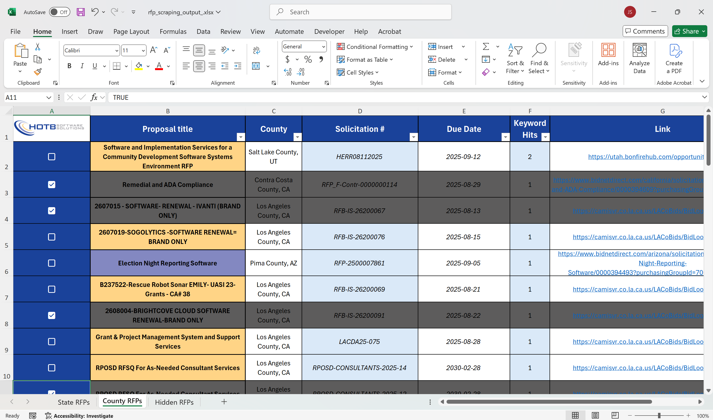

# RFP Scraper

**Automated RFP scraping for all U.S. states and major counties, with a modern, user-friendly GUI.**

## Table of Contents

1. [Introduction](#introduction)
2. [Features](#features)
3. [Screenshots](#screenshots)
4. [Installation](#installation)
5. [Usage](#usage)
6. [GUI Overview](#gui-overview)

   * [Main Window](#main-window)
   * [Home Page](#home-page)
   * [Run Page](#run-page)
   * [Status Page](#status-page)
7. [Configuration](#configuration)
8. [Project Structure](#project-structure)
9. [Dependencies](#dependencies)
10. [Testing](#testing)
11. [Roadmap](#roadmap)
12. [Contributing](#contributing)
13. [License](#license)
14. [Contact / Support](#contact--support)


## Introduction
RFP Scraper is a cross-platform desktop application that automates the collection of Requests for Proposals (RFPs) from all 50 U.S. states, D.C., and major counties. It features a PyQt5 GUI for keyword-driven searches, state/county selection, real-time progress, and Excel export. The codebase is modular, extensible, and robust for production use.

## Features
- **Comprehensive Coverage:** Scrapes RFPs from all 50 states, D.C., and 17 major counties (with individual modules for each).
- **Keyword Search:** Enter keywords to filter RFPs; supports multi-line input and persistent storage.
- **State & County Selection:** Select any combination of states and counties, or use "Select All" for batch runs.
- **Responsive GUI:** PyQt5 interface with Home, Run, and Status pages; background scraping keeps UI responsive.
- **Progress & Logging:** Real-time log tailing, time estimates, and rotating log files for error tracking.
- **Excel Export & Caching:** Results exported to Excel, with recent outputs cached and auto-opened on completion.
- **Persistent Data:** Stores averages, hidden IDs, and keywords for future runs.
- **Robust Error Handling:** Exception management, retry logic, and status reporting for each region.
- **Extensible Architecture:** Modular scrapers for each state/county; easy to add new regions or features.

## Screenshots

1. **Home Page**
   
   *Enter keywords (left), select states/counties (center), click **Run** (right).*

2. **Run Page**
   
   *Live log output streams as each scraper runs; click **Cancel** to abort. Time remaining counter.*

3. **Status Page**
   
   *✅ Passed or ❌ Failed per state/county. “Back to Filters” returns you to Home without clearing keywords.*

4. **Excel Output Example**
   
   *Standardized columns, text wrapping, and formatted dates.*

## Installation
### Prerequisites
- Python 3.8+
- OS: Windows 10/11, macOS 10.15+, Linux (Ubuntu 20.04+)

### Step-by-Step
```powershell
# Clone and set up virtual environment
git clone https://github.com/jasonstaker/rfp-scraper.git
cd rfp-scraper
python -m venv venv

# Activate (Windows)
.\venv\Scripts\Activate.ps1

# Install dependencies
pip install -e .
```
To launch:
```powershell
rfp-scraper
```

## Usage
1. Launch the app.
2. Enter keywords (one per line).
3. Select states and/or counties.
4. Click **Run** to start scraping.
5. View progress and logs in real time.
6. Review results and export to Excel.

## GUI Overview
- **Home Page:** Keyword editor, state/county selection, run button.
- **Run Page:** Log output, time-left indicator, cancel button.
- **Status Page:** Results table, error display, back button.

## Configuration
- All configuration is managed in `src/config.py`.
- Persistent data (keywords, averages, hidden IDs) stored in `persistence/`.
- Log files and Excel exports stored in `output/`.

## Project Structure
```
rfp-scraper/
├── assets/                # Logos, styles, screenshots
├── output/                # Logs and Excel exports
├── persistence/           # Persistent data (averages, hidden IDs, keywords)
├── scripts/               # Entry point
├── src/
│   ├── config.py          # Configuration
│   ├── scraper/
│   │   ├── core/          # Base scraper classes, errors
│   │   ├── exporters/     # Excel exporter
│   │   ├── scrapers/
│   │   │   ├── states/    # 48 states + DC
│   │   │   ├── counties/  # 44 major counties
│   │   └── utils/         # Data/text/date utilities
│   ├── ui/                # GUI (main window, pages, scaling)
├── tests/                 # Unit tests
├── README.md
├── LICENSE
├── pyproject.toml
```

## Dependencies
- requests
- selenium
- pandas
- beautifulsoup4
- webdriver-manager
- openpyxl
- xlsxwriter
- lxml
- xlrd
- pillow
- pyqt5

## Testing
```powershell
pytest
```
Covers core logic, utilities, and basic runner integration. GUI testing is manual.

## Roadmap
- Progress bars per state/county
- Auto-complete keyword suggestions
- CSV/PDF export options
- Extended GUI improvements

## Contributing
Contributions are welcome! Please submit focused, high-quality PRs or email ideas.

## License
MIT License — see [LICENSE](LICENSE).

## Contact / Support
**Author:** Jason Staker ([jason.staker@yahoo.com](mailto:jason.staker@yahoo.com))
