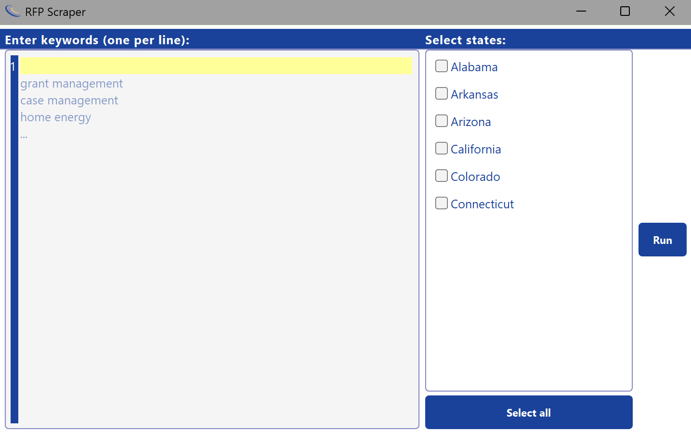
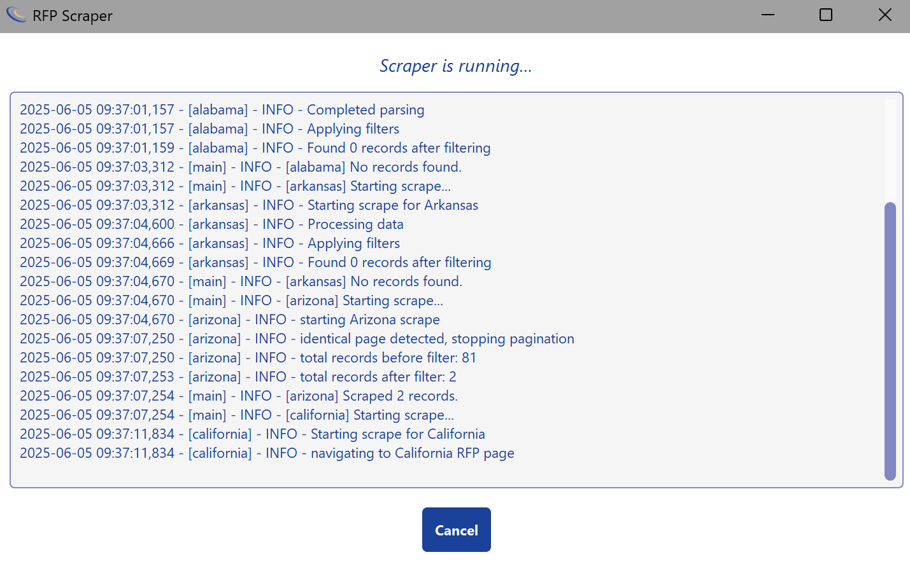
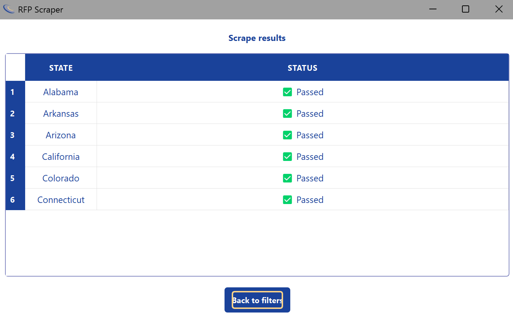

# RFP Scraper

**Tagline:** Automated RFP scraping with a simple, intuitive GUI.

## Table of Contents

1. [Introduction](#introduction)
2. [Features](#features)
3. [Screenshots](#screenshots)
4. [Installation](#installation)
5. [Usage](#usage)
6. [GUI Overview](#gui-overview)

   * [Main Window](#main-window)
   * [Run Page](#run-page)
   * [Status Page](#status-page)
7. [Configuration](#configuration)
8. [Project Structure](#project-structure)
9. [Dependencies](#dependencies)
10. [Testing](#testing)
11. [Roadmap](#roadmap)
12. [Contributing](#contributing)
13. [License](#license)
14. [Contact / Support](#contact--support)

## Introduction

RFP Scraper is a cross-platform desktop application designed to automate the process of fetching current Request for Proposals (RFPs) from multiple state procurement websites. It features:

* A clean PyQt-based GUI for selecting states, entering keywords, and monitoring progress.
* Automated background scraping with retry logic and caching of results.
* Export to Excel of all scraped RFP records.
* A status page showing which state scrapers succeeded or failed.

## Features

* **Keyword-driven Searches**
  Enter one keyword per line; the scraper uses those terms to query each state’s RFP portal.

* **Multi-State Selection**
  Pick any combination of supported states from a checkable list, or click “Select All” to run them all.

* **Background Scraping with Cancel**
  The scraper runs in a separate thread so the UI remains responsive. Click “Cancel” at any time to stop.

* **Real-time Log Output**
  View live progress and errors in the Run page as each state is processed.

* **Results Status Page**
  After scraping completes, see a table indicating “Passed” or “Failed” for each state.

* **Excel Export & Caching**
  All successful RFP results are written to a timestamped Excel file (keeping only the latest five). The most recent export can be opened automatically.

* **Persistent Keywords**
  Keywords load from and write to a local `keywords.txt` file so your list is always up to date.

## Screenshots

1. **Home Page**
   
   *Enter keywords on the left, select states in the middle, and click “Run” on the right.*

2. **Run Page**
   
   *Live log output streams as each state’s scraper runs. Click “Cancel” to stop.*

3. **Status Page**
   
   *After completion, see which scrapers passed (✅) or failed (❌), and return to filters.*

4. **Output Example**
   
   *After the program finishes, this is what could be displayed.*

## Installation

### Prerequisites

* **Python 3.8+**
* **Platform support:** Windows 10/11, macOS 10.15+, Linux (Ubuntu 20.04+).

### Step-by-Step

1. **Clone the repository**

   ```bash
   git clone https://github.com/jasonstaker/rfp-scraper.git
   cd rfp-scraper
   ```

2. **Create and activate a virtual environment**

   ```bash
   python3 -m venv venv
   # macOS/Linux:
   source venv/bin/activate
   # Windows PowerShell:
   # .\venv\Scripts\Activate.ps1
   ```

3. **Install dependencies**

   ```bash
   pip install -e .
   ```

4. **Run the Application**

   ```bash
   rfp-scraper
   ```

   Or click the icon.

## Usage

1. **Launch the app** (double-click icon or run `python main.py`).
2. On the **Home Page**:

   * Enter one keyword per line (e.g., “grants”, “IT services”).
   * Check one or more states from the list (or click “Select All”).
   * Click **Run**.
3. The **Run Page** appears:

   * Watch live log entries as each state is scraped.
   * Click **Cancel** to abort at any time.
4. When scraping completes, the **Status Page** shows:

   * A table of each selected state with ✅ Passed or ❌ Failed.
   * A “Back to Filters” button to return to Home and adjust keywords/states.
5. The latest Excel file is saved in `output/cache/` and opened automatically on success.

## GUI Overview

### Main Window

* **Navigation via QStackedWidget:**

  * Home → Run → Status pages in a single window.
* **Half-screen sizing:**

  * Window resizes to half of your monitor’s width and height.

### Home Page

* **Keyword Editor (left):**

  * A multi-line `CodeEditor` with line numbers.
  * Pre-loads from `keywords.txt`.
* **State Selection (center):**

  * A scrollable, checkable `QListWidget`.
  * “Select All” toggles all states at once.
* **Run Button (right):**

  * Click to begin scraping with entered keywords and selected states.

### Run Page

* **Log Output:**

  * A read-only `QPlainTextEdit` that tails `scraper.log` for new lines only.
* **Cancel Button:**

  * Stops the background worker and returns to Home immediately.

### Status Page

* **Results Table:**

  * Two columns: **State** and **Status** (✅ Passed / ❌ Failed).
  * Displays any run-level error message at the top.
* **Back to Filters Button:**

  * Returns to Home Page without clearing the keyword box.

## Configuration

* **`src/config.py`** contains paths and defaults:

  * `KEYWORDS_FILE`: where keywords are read/written.
  * `CACHE_DIR`: where the last five Excel exports are stored.
  * `LOG_FILE`: path to `output/scraper.log`.
* **`scraper/config/settings.py`** defines:

  * `STATE_RFP_URL_MAP`: mapping of state names to RFP URLs.
  * `AVAILABLE_STATES`: list of state keys used by the UI.

## Project Structure

```text
rfp-scraper/
├── README.md
├── LICENSE
├── scripts/
│   └── main.py               # CLI entry point
├── assets/
│   ├── hotb_logo.jpg
│   ├── hotb_logo_square.png
│   └── output_example.png
├── output/
│   ├── cache/                # Latest 5 Excel outputs
│   └── scraper.log
├── persistence/
│   └── hidden_ids.json       # For what the user wants to hide
├── src/
│   ├── config.py             # Paths & defaults
│   ├── ui/
│   │   ├── main_window.py
│   │   └── pages/
│   │       ├── home_page.py
│   │       ├── run_page.py
│   │       └── status_page.py
│   └── scraper/
│       ├── config/
│       │   ├── keywords.txt  # (auto-written by runner)
│       │   └── settings.py   
│       ├── core/
│       ├── exporters/
│       ├── scrapers/         # Where all the state scrapers live
│       ├── utils/
│       ├── logging_config.py
│       └── runner.py
└── tests/                    # Unit tests (e.g., test_core.py, test_util.py)
```

## Testing

```bash
# Run all tests with pytest:
pytest
```

* **Unit tests** are under `tests/`.
* Tests cover core scraper logic and utility functions.
* GUI behavior can be manually verified (no automated GUI tests included yet).

## Roadmap

* **Add multi-thread progress bar** for each state’s scraping progress.
* **Support more states** by extending `STATE_RFP_URL_MAP`.
* **Implement keyword “suggestions”** based on past scrapes (auto-complete).
* **Option to export report in CSV or PDF** in addition to Excel.
* **Various Improvments in GUI** based on feedback

## Contributing

We are currently not accepting all changes from everybody. If you have an idea for the project please send me an email below.

## License

This project is licensed under the **MIT License**—see the [LICENSE](LICENSE) file for details.

## Contact / Support

* **Author:** Jason Staker (`jason.staker@yahoo.com`)

Feel free to send me an email if you need help or want to contribute.
